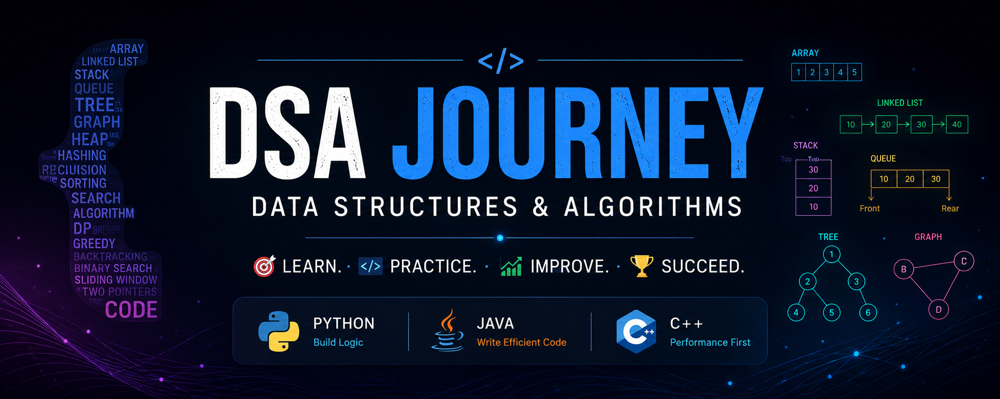

<p align="center">
  
</p>

<h1 align="center">🚀 Data Structures and Algorithms</h1>

<p align="center">
  My personal journey of learning Data Structures and Algorithms from basics to advanced.
</p>

<p align="center">
  🐍 Python &nbsp; • &nbsp; ☕ Java &nbsp; • &nbsp; ⚙️ C++
</p>

---

Welcome to my **Data Structures and Algorithms (DSA) learning repository**.

This repository documents my journey of learning DSA from the basics to advanced concepts. I created this repository to organize everything I learn, practice problems consistently, improve my problem-solving skills, and build a strong foundation in computer science.

---

## 🧠 What I Will Learn

My DSA journey is organized from beginner to advanced topics.

### 🟢 Fundamentals

- Introduction to DSA - Problem-Solving Approach - Time Complexity - Space Complexity - Big O Notation - Best, Average, and Worst Case Analysis

### 🟢 Core Data Structures

- Arrays - Strings - Hashing - Linked Lists - Stack - Queue - Trees - Binary Search Trees - Heap - Priority Queue - Graphs

### 🟡 Important Algorithms and Patterns

- Recursion - Sorting - Binary Search - Two Pointers - Sliding Window - Prefix Sum - Greedy Algorithms - Backtracking - Dynamic Programming

### 🔴 Advanced Concepts

- Trie - Segment Tree - Fenwick Tree - Disjoint Set Union - Bit Manipulation - Advanced Graph Algorithms - Advanced Tree Problems

---

## 💻 Programming Languages

I will practice important DSA concepts and problems using:

 🐍 **Python**  ☕ **Java**  ⚙️ **C++**

---

## 📂 Repository Structure

```text id="2o9zvx"
DSA/
│
├── README.md
│
├── 00_Repository_Guide/
│   ├── DSA_Roadmap.md
│   └── How_to_Use_This_Repository.md
│
├── 01_DSA_Fundamentals/
├── 02_Arrays/
├── 03_Strings/
├── 04_Hashing/
├── 05_Recursion/
├── 06_Sorting/
├── 07_Binary_Search/
├── 08_Two_Pointers/
├── 09_Sliding_Window/
├── 10_Linked_List/
├── 11_Stack/
├── 12_Queue/
├── 13_Trees/
├── 14_BST/
├── 15_HEAP_PRIORITY_QUEUE/
├── 16_GREEDY/
├── 17_GRAPHS/
├── 18_BACKTRACKING/
├── 19_DYNAMIC_PROGRAMMING/
├── 20_ADVANCED_DSA/
├── 21_INTERVIEW_PATTERNS/
├── 22_REVISION/
└── 23_DAILY_LOG/
```

Each main topic will contain concepts, explanations, problems, solutions, and notes related to that topic.

---

## 📌 How I Will Document Problems

For important problems, my notes may include:

- Concept
- Problem Statement
- Real-World Example
- Intuition
- Brute-Force Approach
- Optimized Approach
- Step-by-Step Explanation
- Dry Run
- Python Solution
- Java Solution
- C++ Solution
- Time Complexity
- Space Complexity
- Common Mistakes
- Key Takeaways

The exact format may change depending on the topic and problem.

---

## 🎯 My Learning Principles

I want to follow a simple approach throughout this journey:

> **Understand first. Practice consistently. Learn from mistakes. Revise regularly.**

---
This repository will continue to grow as I learn.
